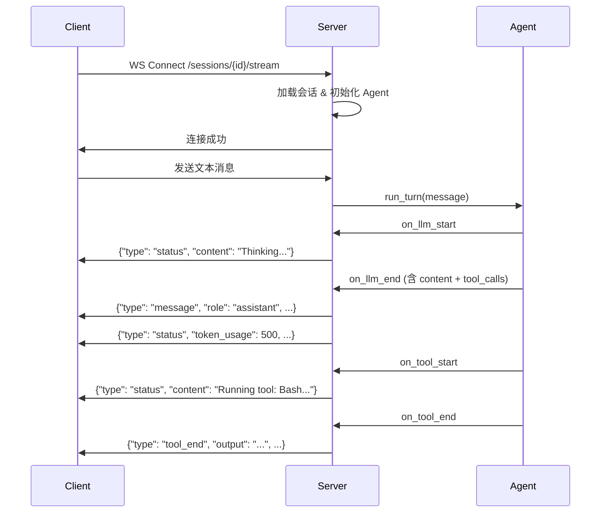

# Agent Framework — API 参考文档

> **Base URL**: `http://localhost:8000`  
> **传输协议**: HTTP/1.1 + WebSocket  
> **数据格式**: JSON (`Content-Type: application/json`)

---

## 目录

- [Agents（智能体管理）](#agents智能体管理)
- [Sessions（会话管理）](#sessions会话管理)
- [WebSocket 实时通信](#websocket-实时通信)
- [Skills（技能管理）](#skills技能管理)
- [Tools（工具管理）](#tools工具管理)
- [系统信息](#系统信息)
- [WebSocket 事件协议](#websocket-事件协议)

---

## Agents（智能体管理）

### 列出所有 Agent

```
GET /agents
```

**描述**: 获取所有已注册的 Agent 定义列表。

**响应**: `200 OK`

```json
[
  {
    "uuid": "a1b2c3d4-...",
    "agent_name": "Test",
    "version": "0.1.3",
    "description": "A test agent",
    "instructions": "You are a helpful assistant...",
    "adviced_model_kind": "smart",
    "tools": ["Bash", "Read", "Write"],
    "skills": [],
    "sub_agents": {},
    "workflow": null,
    "mcp_servers": [],
    "knowledge_base": []
  }
]
```

---

### 获取单个 Agent

```
GET /agents/{uuid}
```

| 参数   | 位置 | 类型   | 描述          |
|--------|------|--------|---------------|
| `uuid` | path | string | Agent UUID    |

**响应**:
- `200 OK` — 返回 AgentSpec
- `404 Not Found` — Agent 不存在

---

### 创建 Agent

```
POST /agents
```

**请求体**: `AgentSpec` 对象

```json
{
  "agent_name": "MyAgent",
  "description": "A custom agent",
  "instructions": "You are...",
  "adviced_model_kind": "smart",
  "tools": ["Bash"],
  "skills": [],
  "sub_agents": {},
  "workflow": null
}
```

**响应**: `200 OK`

```json
{
  "status": "created",
  "name": "MyAgent",
  "uuid": "generated-uuid"
}
```

**错误**: `400 Bad Request` — 参数校验失败

---

### 更新 Agent

```
PUT /agents/{uuid}
```

| 参数            | 位置 | 类型   | 描述                |
|-----------------|------|--------|---------------------|
| `uuid`          | path | string | Agent UUID          |

**请求体**: 完整的 `AgentSpec` 对象

**响应**: `200 OK`

```json
{
  "status": "updated",
  "uuid": "a1b2c3d4-...",
  "name": "MyAgent"
}
```

**错误**: `404 Not Found`

---

### 删除 Agent

```
DELETE /agents/{uuid}
```

| 参数   | 位置 | 类型   | 描述        |
|--------|------|--------|-------------|
| `uuid` | path | string | Agent UUID  |

**响应**: `200 OK`

```json
{
  "status": "deleted",
  "uuid": "a1b2c3d4-..."
}
```

**错误**: `404 Not Found`

---

## Sessions（会话管理）

### 列出会话

```
GET /sessions
```

| 参数         | 位置  | 类型   | 必填 | 描述              |
|--------------|-------|--------|------|-------------------|
| `agent_name` | query | string | 否   | 按 Agent 名称过滤 |

**响应**: `200 OK`

```json
[
  {
    "session_id": "abc123",
    "agent_name": "Test",
    "title": "做一个计划...",
    "created_at": "2026-02-23T04:00:00",
    "updated_at": "2026-02-23T04:05:00",
    "message_count": 12,
    "summary": null,
    "parent_session_id": null
  }
]
```

---

### 创建会话

```
POST /sessions
```

**请求体**:

```json
{
  "agent_name": "Test",
  "resume_session_id": null
}
```

| 字段                | 类型   | 必填 | 描述                        |
|---------------------|--------|------|-----------------------------|
| `agent_name`        | string | 是   | 关联的 Agent 名称           |
| `resume_session_id` | string | 否   | 恢复已有会话的 ID（可选）   |

**响应**: `200 OK`

```json
{
  "session_id": "generated-uuid",
  "created_at": "2026-02-23T04:00:00"
}
```

---

### 获取会话详情

```
GET /sessions/{session_id}
```

| 参数         | 位置 | 类型   | 描述      |
|--------------|------|--------|-----------|
| `session_id` | path | string | 会话 ID   |

**响应**: `200 OK`

```json
{
  "session_id": "abc123",
  "agent_name": "Test",
  "messages": [
    {"role": "user", "content": "Hello"},
    {"role": "assistant", "content": "Hi there!"}
  ],
  "metadata": {
    "agent_name": "Test",
    "model": "minimax/MiniMax-M2.5",
    "input_tokens": 500,
    "output_tokens": 200
  },
  "parent_session_id": null,
  "system_prompt": "You are a helpful assistant...",
  "input_tokens": 500,
  "output_tokens": 200,
  "estimated_cost": 0.003500
}
```

**错误**: `404 Not Found`

---

### 删除会话

```
DELETE /sessions/{session_id}
```

**响应**: `200 OK`

```json
{
  "status": "deleted",
  "session_id": "abc123"
}
```

---

## WebSocket 实时通信

### 连接会话流

```
WebSocket /sessions/{session_id}/stream
```

**描述**: 建立 WebSocket 连接以实时接收 Agent 的处理事件和发送用户消息。

**连接流程**:



**客户端发送**: 纯文本字符串（用户消息）

**服务端推送事件**: 详见 [WebSocket 事件协议](#websocket-事件协议)

**错误关闭码**:
- `1008` — 会话不存在或 Agent 未找到

---

## Skills（技能管理）

### 列出已安装技能

```
GET /skills
```

**响应**: `200 OK`

```json
[
  {"name": "web_search", "description": "Search the web for information"}
]
```

---

### 搜索技能商店

```
GET /skills/store?query={query}
```

| 参数    | 位置  | 类型   | 必填 | 描述       |
|---------|-------|--------|------|------------|
| `query` | query | string | 否   | 搜索关键词 |

**响应**: `200 OK` — 返回匹配技能列表

**错误**: `500 Internal Server Error`

---

### 安装技能

```
POST /skills/install
```

**请求体**:

```json
{
  "skill_name": "web_search"
}
```

**响应**: `200 OK`

```json
{
  "status": "installed",
  "output": "Successfully installed web_search"
}
```

---

### 获取技能详情

```
GET /skills/{name}
```

**响应**: `200 OK`

```json
{
  "name": "web_search",
  "description": "Search the web for information"
}
```

**错误**: `404 Not Found`

---

### 列出技能文件

```
GET /skills/{name}/files
```

**响应**: `200 OK`

```json
{
  "files": [
    {"name": "SKILL.md", "path": "SKILL.md", "size": 1024},
    {"name": "search.py", "path": "scripts/search.py", "size": 2048}
  ]
}
```

---

### 获取技能文件内容

```
GET /skills/{name}/files/{path}
```

| 参数   | 位置 | 类型   | 描述                |
|--------|------|--------|---------------------|
| `name` | path | string | 技能名称            |
| `path` | path | string | 文件相对路径         |

**响应**: `200 OK`

```json
{
  "content": "# SKILL.md\n...",
  "path": "SKILL.md"
}
```

**错误**:
- `403 Forbidden` — 路径穿越攻击被阻止
- `404 Not Found`

---

## Tools（工具管理）

### 列出所有工具

```
GET /tools
```

**响应**: `200 OK`

```json
[
  {
    "name": "Bash",
    "description": "Execute a shell command",
    "parameters": {
      "type": "object",
      "properties": {
        "command": {"type": "string", "description": "The shell command to execute"}
      },
      "required": ["command"]
    }
  }
]
```

---

### 获取工具源码

```
GET /tools/{name}/code
```

**响应**: `200 OK`

```json
{
  "code": "from tools.native import tool\n\n@tool(name=\"Bash\", ...)\ndef bash(command: str) -> str:\n    ..."
}
```

**错误**: `404 Not Found`

---

### 更新工具源码

```
PUT /tools/{name}/code
```

**请求体**:

```json
{
  "code": "from tools.native import tool\n\n@tool(name=\"Bash\", ...)\ndef bash(command: str) -> str:\n    ..."
}
```

**响应**: `200 OK` — `{"status": "updated"}`

---

### 创建工具

```
POST /tools
```

**请求体**:

```json
{
  "name": "my_tool",
  "description": "A custom tool",
  "code": "from tools.native import tool\n..."
}
```

| 字段          | 类型   | 必填 | 描述                             |
|---------------|--------|------|----------------------------------|
| `name`        | string | 是   | 工具名称（需为合法 Python 标识符）|
| `description` | string | 是   | 工具描述                         |
| `code`        | string | 否   | 源码（留空则使用默认模板）       |

**响应**: `200 OK` — `{"status": "created", "name": "my_tool"}`

**错误**: `400 Bad Request` — 已存在同名工具

---

### 删除工具

```
DELETE /tools/{name}
```

**响应**: `200 OK` — `{"status": "deleted", "name": "my_tool"}`

**错误**: `404 Not Found`

---


## 系统信息

### 全局统计

```
GET /stats
```

**响应**: `200 OK`

```json
{
  "agents_count": 5,
  "skills_count": 3,
  "tools_count": 6,
  "sessions_total": 42,
  "sessions_active": 2,
  "total_input_tokens": 150000,
  "total_output_tokens": 80000,
  "total_tokens": 230000,
  "total_estimated_cost": 1.234567
}
```

---

### 获取框架配置

```
GET /config
```

**响应**: `200 OK` — 返回当前 `FrameworkConfig` 的完整 JSON。

---

### 查询 Tracing 日志

```
GET /traces?limit=100&offset=0
```

| 参数     | 位置  | 类型 | 默认值 | 描述                     |
|----------|-------|------|--------|--------------------------|
| `limit`  | query | int  | 100    | 每页返回条目数           |
| `offset` | query | int  | 0      | 偏移量（按时间倒序分页） |

**响应**: `200 OK`

```json
{
  "traces": [
    {
      "event": "llm_end",
      "session_id": "abc123",
      "model": "minimax/MiniMax-M2.5",
      "tokens": 500,
      "timestamp": "2026-02-23T04:01:00Z"
    }
  ],
  "total": 1500
}
```

---

## WebSocket 事件协议

通过 `WS /sessions/{session_id}/stream` 接收的事件遵循以下格式：

### `status` — 状态更新

```json
{
  "type": "status",
  "status": "busy",
  "content": "Thinking...",
  "token_usage": 500,
  "input_tokens": 300,
  "output_tokens": 200,
  "estimated_cost": 0.003500
}
```

### `message` — Assistant 消息

```json
{
  "type": "message",
  "role": "assistant",
  "content": "Hello! How can I help you?",
  "tool_calls": [
    {
      "id": "call_abc123",
      "name": "Bash",
      "arguments": "{\"command\": \"ls -la\"}"
    }
  ]
}
```

### `tool_start` — 工具开始执行

```json
{
  "type": "tool_start",
  "tool": "Bash",
  "arguments": {"command": "ls -la"}
}
```

### `tool_end` — 工具执行完成

```json
{
  "type": "tool_end",
  "tool": "Bash",
  "output": "total 42\ndrwxr-xr-x ...",
  "is_error": false
}
```

### `new_sub_session` — 子 Agent 会话创建

```json
{
  "type": "new_sub_session",
  "parent_session_id": "abc123",
  "child_session_id": "def456",
  "agent_name": "Planner"
}
```


## 服务启动

### 通过 Python 模块启动

```bash
python -m server
# 或
uvicorn server:app --host 0.0.0.0 --port 8000 --reload
```

```
